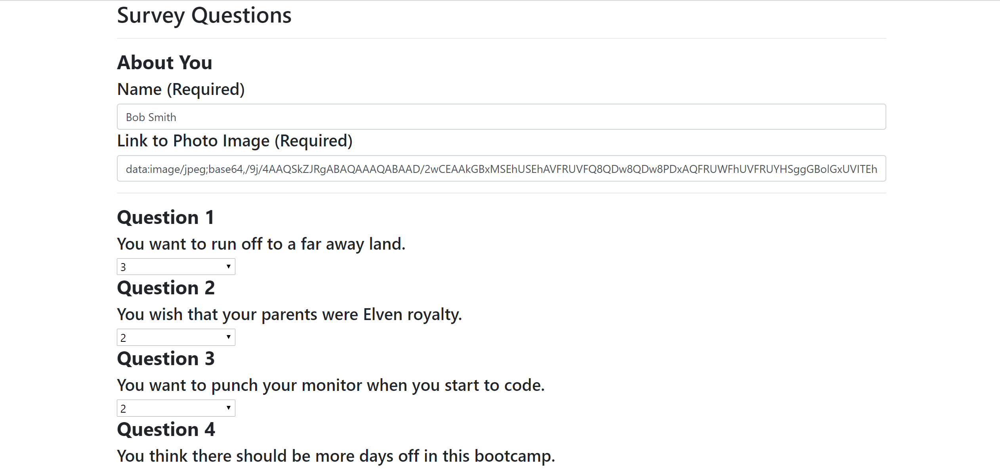

# FriendFinder
This application takes in user input and compares it to other user input to see how well users match. 

## How it works
This is a full stack application made using:
* HTML
* CSS
* JavaScript
* Bootstrap 
* Node.js
* Express
* Heroku (for deployment)

Friend Finder uses a quiz style format to capture user information. The quiz requires users to submit a Name, Link to a photo of themselves, and answer a series of 10 personality questions.

Upon hitting the submit button the user's answers are run through an algorithm that compares to previous user's answers. 

* Once all 10 answers in the array have been run through the user with the least differences is selected.

Once a match is found, a modal pops up with a new friend's name and photo.

A link to the Friends API will display the answers from all of the previous monsters who have taken the test.

### Deployed to Heroku
The app is deployed to Heroku <a href="https://secret-fortress-29212.herokuapp.com/surveyhttps://friendfinder-monsteredition.herokuapp.com">Friend Finder</a>.

